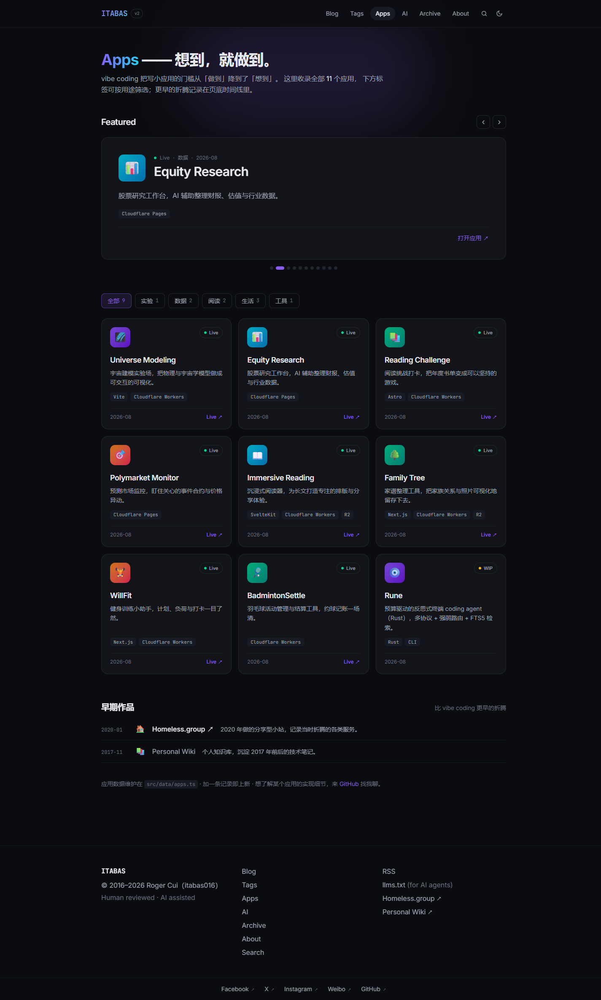
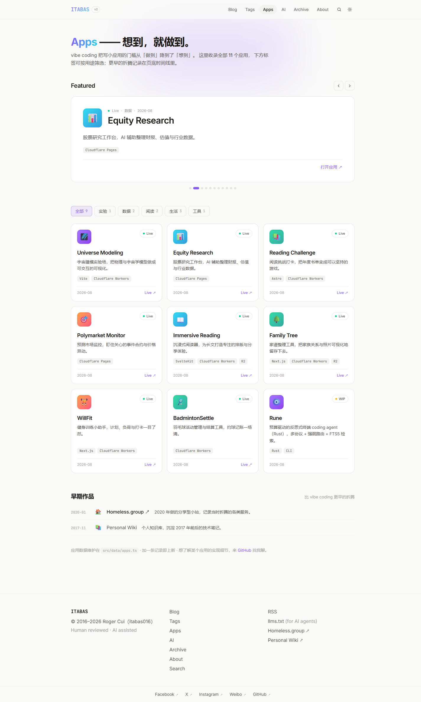
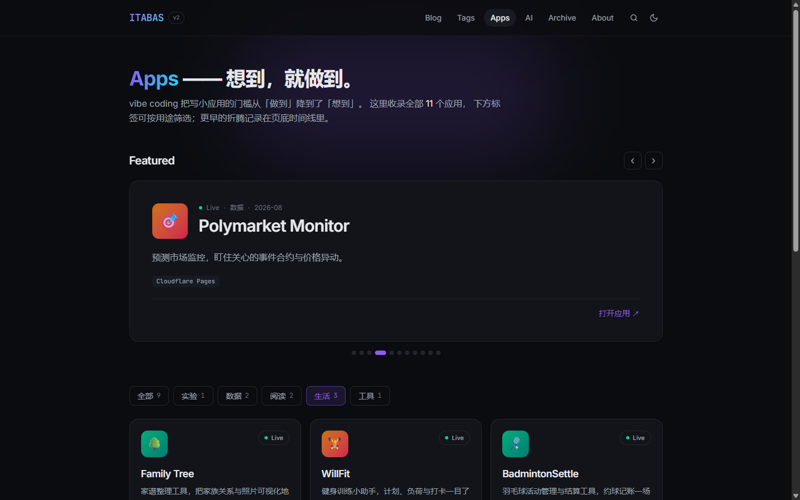
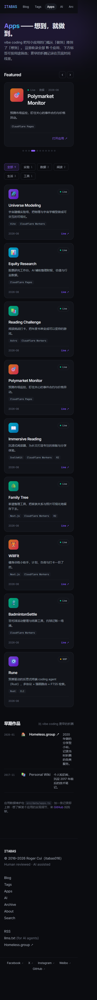

# /apps 页面重设计方案（去 AI 味修订版）

> 版本：v4 · 2026-09-05 · Roger Cui（itabas016）× Claude Code
> 状态：P1 已实现，本文档截图即当前形态；P2 截图素材待补
> 关联：`DESIGN.md` §6（数据契约与展示形态的单一段落摘要）、`AGENTS.md`（发布规范）

## 1. 背景与问题

应用数量将从当前 11 个增长到十几个，旧版三轨跑马灯有三个结构性问题：

1. **不可浏览**：悬停只能暂停单轨，无法筛选、无法定位、无法分享某个应用的直达位置；
2. **没有推广位**：所有应用平权滚动，最值得看的和 2017 年的存档作品混在一起；
3. **装饰依赖症**：视觉全靠 emoji 渐变色块撑，应用一多就是一墙彩色噪声。

v2 方案（跑马灯 → 精选大卡 + 筛选网格）解决了结构问题，但评审发现精选区引入了新的 AI 味装饰（渐变横幅、水印大字、emoji pill）。v3 在结构不变的前提下做减法；v4 按 Roger 反馈重构了推广位形态。

## 2. 设计原则

1. **眼球与效率分工**：首页速览区负责 3 秒眼球，`/apps` 负责浏览与转化；
2. **按用途分类**：访客按「我想看什么」浏览，技术栈是卡片 tag，状态与 vibe-coded 是元信息，都不参与分类；
3. **装饰让位排印**：层级用字号、字重、留白和 hairline 分隔线建立，不用装饰图说话——这是去 AI 味的核心；
4. **数据驱动渐进增强**：分类字段可选（漏填落「未分类」）、无 JS 时内容完整可读、无截图时排印兜底。

## 3. 去 AI 味修订清单（v2 → v3）

| # | 元素 | v2（AI 味） | v3（修订） | 依据 |
|---|---|---|---|---|
| 1 | 精选区视觉 | 渐变色块 + 大 emoji + 英文名水印 | 排印式索引行：大字应用名 + hairline 分隔 + 留白 | emoji 当图标、装饰性水印是典型 AI 指纹；层级应交给字号 |
| 2 | 精选布局 | 3+2+通栏 bento 大卡 | 3 行全宽索引行 | bento 是 AI 默认展示语法，索引行更贴「目录页」定位 |
| 3 | 筛选 pill | emoji + 文字 | 纯文字 + mono 计数 | 同 #1 |
| 4 | Hero eyebrow | uppercase「VIBE CODING GALLERY」 | 删除 | 口号式装饰标签，信息量为零 |
| 5 | 区块注解 | 「手工挑的 3 个，值得先玩」 | 删除 | 填充式贫嘴文案 |
| 6 | 主行动 | 「打开应用」描边按钮 ×3 | 文字链 | 一页一个动作层级即可，重复按钮制造假层级 |
| 7 | 数字条 | 4 项（含「最早可追溯到 2017」） | 3 项 | 页底时间线已经讲了 2017 的故事，不重复 |
| 8 | pill 圆角 | 全圆 9999px | 8px | 贴合 Terminal × Paper 的方角气质 |

**有意保留项**（非遗漏）：

- Hero 径向光晕：全站 Hero 语言（`DESIGN.md` §4.1），非本页私加；
- 「Apps」渐变字：全站锁定的 violet→cyan 单 accent，只用于强调处；
- 标题「—— 想到，就做到。」：作者原句，人的声音；
- 网格卡片的小 emoji 图标位：既有卡片语言（个人项目的小头像），保留。

## 3.5 v4 修订记录（2026-09-05，Roger 反馈）

| # | 元素 | v3 | v4 | 理由 |
|---|---|---|---|---|
| 1 | vibe-coded 标注 | 精选行与网格卡均有 ✦ 徽章 | `/apps` 全页移除（`AppCard` 增加 `vibeBadge` 开关，首页速览保留）；数字条已随 §4 删除 | 应用页只谈应用本身，AI 披露由首页与 `/ai` 页承担 |
| 2 | Featured 形态 | 3 行排印索引（手工 `featured` 挑选） | **全量应用大卡自动轮播**：一屏一大卡，5s 自动翻页，箭头 + 页码点可手动，悬停/聚焦暂停，循环播放 | 推广位要给每个应用出场机会，不做人工挑选 |
| 3 | Hero 数字条 | 应用/在线/vibe-coded 三项统计 | 删除 | 数字 self-congratulatory，应用本身说话 |
| 4 | 分类筛选作用域 | 筛选时精选区隐藏、精选应用回网格 | 分类只过滤下方网格，**轮播常驻** | 轮播即全量目录的放大镜，无需让位 |
| 5 | 应用链接 | 个别用 `*.pages.dev` | 对照 Cloudflare API 全量核实：**有自定义域名一律用自定义域名**（reading-challenge / family-tree 本次切换），无自定义域用 `*.pages.dev` 默认域；`wiki.itabas.com` 已下线移除链接 | 链接以部署事实为准 |

## 4. 页面结构（v4 现状）

```
Hero：H1 + 一句话说明（无统计数字条）
──────────────────────────────────────────
Featured：全量大卡自动轮播（11 个应用全部出场）
          卡片 = 状态点 · 分类 · 日期｜emoji 图标位｜大字应用名｜一句话｜stack chips｜打开应用 ↗
          5s 自动翻页 · 循环；箭头按钮 + 页码点手动；悬停/聚焦暂停；reduced-motion 停用自动播放
──────────────────────────────────────────
筛选 pills：全部 9 ｜ 实验 1 ｜ 数据 2 ｜ 阅读 2 ｜ 生活 3 ｜ 工具 1（只过滤下方网格，URL 同步 ?c=）
应用网格：3 列 → 2 列 → 1 列，既有 AppCard；wip 徽章；无 vibe-coded 标注
──────────────────────────────────────────
早期作品时间线：一行一条（年月 · 名称 ↗ · 一句话），灰调；链接已死的（Personal Wiki）退化为纯文本
```

## 5. 分类体系

按用途（访客视角）分五类；技术栈、状态、开发方式均不参与分类：

| 分类 | id | 应用 | 数量 |
|---|---|---|---|
| 实验 | `experiments` | Universe Modeling | 1 |
| 数据 | `data` | Equity Research, Polymarket Monitor | 2 |
| 阅读 | `reading` | Reading Challenge, Immersive Reading | 2 |
| 生活 | `life` | Family Tree, WillFit, BadmintonSettle | 3 |
| 工具 | `tools` | Rune | 1 |
| （时间线） | — | Homeless.group, Personal Wiki（archived） | 2 |

三条原则：`category` 是可选字段，漏填的应用进「未分类」照常展示；archived 不进网格，由 `status` 驱动进时间线；`featured` 是精选位开关，与分类正交。

## 6. 交互与动效（v4）

- **轮播**：scroll-snap 横向轨道 + JS 自动翻页（5s 间隔，循环）。箭头按钮、页码点均可手动；悬停/聚焦暂停，离开恢复；`visibilitychange` 时停走；`prefers-reduced-motion` 停用自动播放且翻页不动画。无 JS 时退化为原生横滑（snap 兜底），控制按钮隐藏。
- **筛选**：约 40 行 vanilla JS 渐进增强，只作用于下方网格；筛选态同步 `?c=<id>` 到 URL（可分享、可后退）；pill 用 `aria-pressed` 驱动选中态，`focus-visible` 有 2px ring；轮播不受筛选影响。
- **无 JS 降级**：筛选条与轮播控制隐藏，轮播可横滑、网格全量可读，零内容丢失。
- **重排动效**：网格淡入上移 200ms（`cubic-bezier(0.23,1,0.32,1)`），stagger 40ms；`prefers-reduced-motion` 时关闭。
- **循环动画**：本页仅轮播自动翻页 1 处（悬停即停）。

## 7. 数据契约（已落地 `src/data/apps.ts`）

```ts
interface App {
  name: string;
  tagline: string;
  emoji: string;           // 小尺寸图标位（网格卡片），不作为大展示图
  stack: string[];
  status: "live" | "wip" | "archived";
  category?: CategoryId;   // experiments/data/reading/life/tools；缺省 = 未分类
  featured?: boolean;      // 精选索引位 + 首页速览优先
  cover?: string;          // public/images/apps/<slug>/cover.png，16:10
  posts?: string[];        // 关联博客文章 slug（P3 互链）
  links?: { live?: string; repo?: string };
  vibeCoded: boolean;
  model?: string;
  addedAt: string;         // YYYY-MM
}
```

加一个应用 = 加一条记录，不改页面代码；所有新字段可选，schema 永不卡住上新。

## 8. 截图（当前实现）

桌面深色 · 整页：



桌面浅色 · 整页：



筛选态（生活，URL `?c=life`；轮播常驻不受影响，只过滤下方网格）：



移动端 375px · 整页：



## 9. 后续阶段

- **P2（素材）**：每个应用补 16:10 截图，放 `public/images/apps/<slug>/cover.png` 并在数据里填 `cover`；精选行右侧自动接入缩略图，网格卡片的渐变图标位可选择升级为截图。
- **P3（可选）**：`/apps/[slug]` 详情页（大图 + 关联文章，利于 SEO）；文章页「相关应用」卡，用 `posts` 字段双向互链。

## 10. 落选方案备查

- **跑马灯 + 悬停分类**：筛选和无限滚动天然冲突；
- **App Store 式 tab 分组**：藏内容、跨类对比差；
- **bento 磁贴墙**：十几格后无信息层级、维护重；
- **渐变大卡精选区**（v2 已实现后否决）：装饰密度高，AI 味明显，改为排印索引行。

---

附：本方案依据仓库本地 skills `ui-audit-redesign`（九维度审计与 AI 指纹清单）、`ui-page-patterns`（Hero 纪律与布局家族）、`ui-motion-craft`（动效时长与 reduced-motion）、`ui-design-tokens`（语义 token 与暗色纪律）、`ui-style-recipes`（反 AI 默认禁令）；`nova-ui` 为移动端体系，仅取其克制思想未引入视觉语言。
